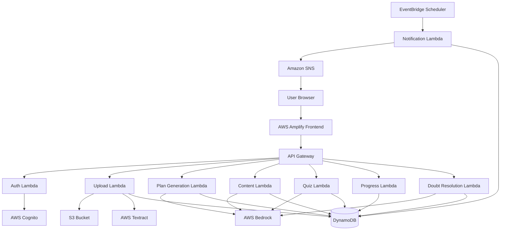
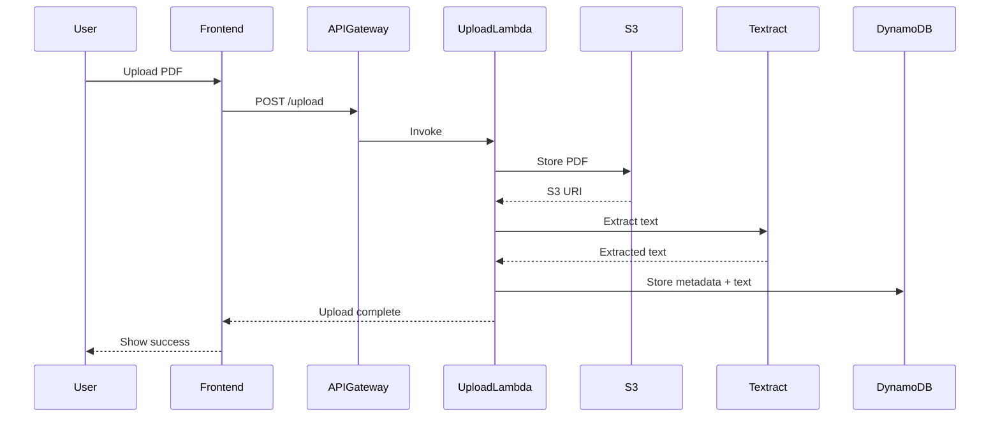
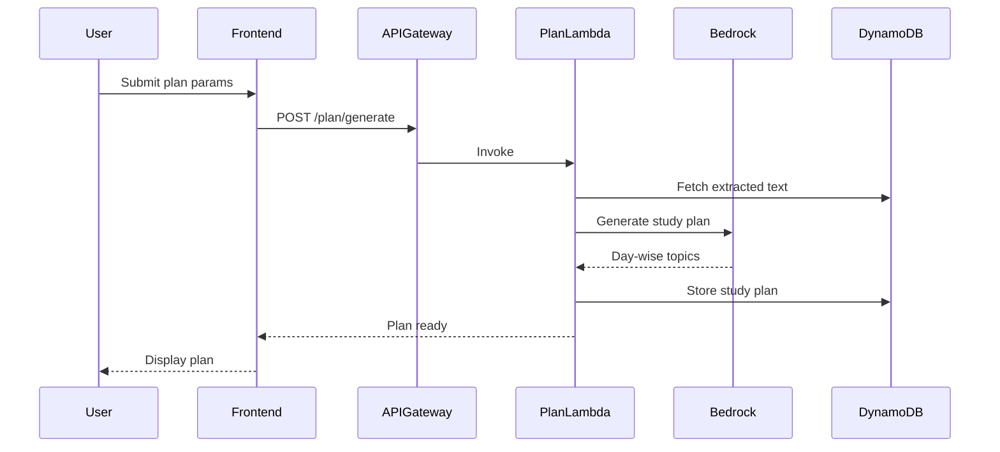
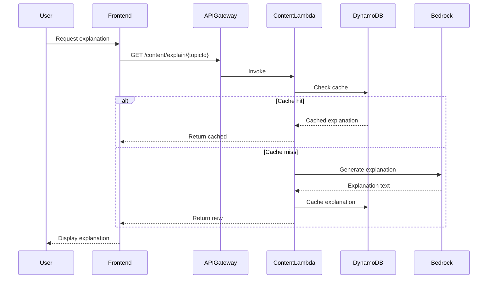

# Design Document: AI Tutor

## Overview

AI Tutor is a serverless, cloud-native learning platform built on AWS that transforms static PDF learning materials into personalized, interactive study experiences. The system leverages AWS Bedrock for generative AI capabilities, AWS Textract for document processing, and a suite of AWS serverless services for scalable, cost-effective operation.

### Key Design Principles

1. **Serverless-First Architecture**: Utilize AWS Lambda, API Gateway, and managed services to eliminate infrastructure management and enable automatic scaling
2. **AI-Driven Personalization**: Use AWS Bedrock's foundation models to generate contextual explanations, quizzes, and study plans tailored to individual learning goals
3. **Caching for Performance**: Cache AI-generated content in DynamoDB to minimize redundant API calls, reduce costs, and support low-bandwidth users
4. **Event-Driven Processing**: Use EventBridge for scheduled tasks like notifications and streak calculations
5. **Security by Design**: Implement authentication, encryption, and data isolation at every layer

### Technology Stack

- **Frontend**: React.js hosted on AWS Amplify
- **API Layer**: Amazon API Gateway (REST APIs)
- **Compute**: AWS Lambda (Node.js/Python)
- **AI Services**: Amazon Bedrock (Claude/Titan models), Amazon Textract
- **Storage**: Amazon S3 (PDF files), Amazon DynamoDB (structured data)
- **Notifications**: Amazon SNS, Amazon EventBridge
- **Authentication**: AWS Cognito

## Architecture

### High-Level Architecture



### Data Flow

#### 1. Material Upload and Processing Flow



#### 2. Study Plan Generation Flow



#### 3. Content Generation Flow (Explanations, Clarifications)



## Components and Interfaces

### 1. Authentication Service

**Responsibility**: User registration, login, session management, and authorization

**Technology**: AWS Cognito + Lambda authorizer

**Key Operations**:
- `registerUser(email, password)`: Create new user account
- `loginUser(email, password)`: Authenticate and return JWT token
- `validateToken(token)`: Verify JWT for API requests
- `refreshToken(refreshToken)`: Issue new access token
- `deleteUser(userId)`: Remove user account

**Data Model**:
```typescript
interface User {
  userId: string;          // Cognito user ID
  email: string;
  languagePreference: 'english' | 'hinglish';
  createdAt: timestamp;
  lastLoginAt: timestamp;
}
```

### 2. Upload and Processing Service

**Responsibility**: Handle PDF uploads, text extraction, and content storage

**Technology**: Lambda + S3 + Textract + DynamoDB

**Key Operations**:
- `uploadPDF(userId, file)`: Store PDF in S3, trigger extraction
- `extractText(s3Uri)`: Use Textract to extract text from PDF
- `storeMaterial(userId, materialId, text)`: Save extracted content to DynamoDB

**Data Model**:
```typescript
interface LearningMaterial {
  materialId: string;      // UUID
  userId: string;          // Owner
  fileName: string;
  s3Uri: string;           // S3 location
  extractedText: string;   // Full text content
  uploadedAt: timestamp;
  status: 'processing' | 'ready' | 'failed';
}
```

**S3 Bucket Structure**:
```
ai-tutor-materials/
  {userId}/
    {materialId}.pdf
```


### 3. Study Plan Service

**Responsibility**: Generate personalized day-wise study plans using AI

**Technology**: Lambda + Bedrock + DynamoDB

**Key Operations**:
- `generatePlan(userId, materialId, params)`: Create AI-generated study plan
- `modifyPlan(userId, planId, newParams)`: Regenerate plan with updated parameters
- `getPlan(userId, planId)`: Retrieve existing plan

**Bedrock Prompt Template** (Study Plan Generation):
```
You are an expert educational planner. Analyze the following learning material and create a structured study plan.

Learning Material:
{extractedText}

Student Parameters:
- Daily study time: {dailyMinutes} minutes
- Total days available: {totalDays} days
- Learning goal: {goal}
- Language preference: {language}

Instructions:
1. Identify key topics and concepts from the material
2. Organize topics in logical learning sequence (foundational → advanced)
3. Distribute topics across {totalDays} days based on complexity and {dailyMinutes} minutes per day
4. For each day, specify:
   - Day number
   - Topics to cover
   - Estimated time per topic
   - Brief learning objective

Output format: JSON array of days with topics
```

**Data Model**:
```typescript
interface StudyPlan {
  planId: string;
  userId: string;
  materialId: string;
  dailyStudyMinutes: number;
  totalDays: number;
  learningGoal: 'exam' | 'interview' | 'exploration';
  days: DayPlan[];
  createdAt: timestamp;
  modifiedAt: timestamp;
}

interface DayPlan {
  dayNumber: number;
  topics: Topic[];
  totalEstimatedMinutes: number;
}

interface Topic {
  topicId: string;
  title: string;
  description: string;
  estimatedMinutes: number;
  completed: boolean;
  completedAt?: timestamp;
}
```

### 4. Content Generation Service

**Responsibility**: Generate explanations, simplified explanations, and term clarifications

**Technology**: Lambda + Bedrock + DynamoDB (with caching)

**Key Operations**:
- `generateExplanation(userId, topicId, language)`: Create topic explanation
- `generateSimplifiedExplanation(userId, topicId, language)`: Create simplified version
- `clarifyTerm(userId, term, context, language)`: Explain technical term
- `curateReferences(topicTitle)`: Generate external resource links

**Bedrock Prompt Template** (Topic Explanation):
```
You are an expert tutor explaining concepts to {goal} students.

Topic: {topicTitle}
Context from study material: {topicContext}
Language: {language}

Provide a comprehensive explanation that includes:
1. Core concept definition
2. Key principles or mechanisms
3. Practical examples
4. Common misconceptions to avoid

Use {language} language. If Hinglish, mix English technical terms with Hindi explanations naturally.
```

**Bedrock Prompt Template** (Simplified Explanation):
```
You are explaining a complex topic to someone new to the subject.

Topic: {topicTitle}
Original explanation: {originalExplanation}
Language: {language}

Create a simplified explanation using:
1. Everyday analogies and metaphors
2. Simple vocabulary (avoid jargon)
3. Step-by-step breakdown
4. Real-world examples from daily life

Use {language} language.
```

**Bedrock Prompt Template** (Reference Curation):
```
Generate 3-5 high-quality external learning resources for the topic: {topicTitle}

For each resource, provide:
1. Title
2. Type (article/video/documentation)
3. URL (use well-known educational platforms)
4. Brief description (1 sentence)

Focus on: official documentation, reputable educational sites, quality video tutorials.
Output format: JSON array
```

**Data Model**:
```typescript
interface Explanation {
  explanationId: string;
  userId: string;
  topicId: string;
  type: 'standard' | 'simplified';
  content: string;
  language: 'english' | 'hinglish';
  references: ExternalReference[];
  generatedAt: timestamp;
  cached: boolean;
}

interface ExternalReference {
  title: string;
  type: 'article' | 'video' | 'documentation';
  url: string;
  description: string;
}

interface Clarification {
  clarificationId: string;
  userId: string;
  term: string;
  context: string;
  explanation: string;
  language: 'english' | 'hinglish';
  generatedAt: timestamp;
}
```

**Caching Strategy**:
- Cache explanations by `(topicId, language, type)` key
- Cache clarifications by `(term, language)` key
- TTL: 30 days for explanations, 90 days for clarifications
- Reduces Bedrock API calls by ~70-80% for popular topics

### 5. Quiz Service

**Responsibility**: Generate and evaluate MCQ quizzes (topic-specific and context-aware)

**Technology**: Lambda + Bedrock + DynamoDB

**Key Operations**:
- `generateTopicQuiz(userId, topicId, language)`: Create 5 MCQs for a topic
- `generateContextAwareQuiz(userId, topicIds, language)`: Create cross-topic quiz
- `evaluateQuiz(userId, quizId, answers)`: Score quiz and provide feedback

**Bedrock Prompt Template** (Topic Quiz):
```
Generate 5 multiple-choice questions to assess understanding of this topic.

Topic: {topicTitle}
Content: {topicContent}
Language: {language}

For each question:
1. Create a clear, specific question
2. Provide 4 answer options (A, B, C, D)
3. Mark the correct answer
4. Provide a brief explanation for the correct answer

Questions should test:
- Conceptual understanding (not just memorization)
- Application of concepts
- Common misconceptions

Output format: JSON array of questions
```

**Bedrock Prompt Template** (Context-Aware Quiz):
```
Generate 5-10 multiple-choice questions that require synthesizing knowledge across multiple topics.

Topics covered:
{topicsList}

Content summaries:
{topicsContent}

Language: {language}

Create questions that:
1. Connect concepts from different topics
2. Test ability to apply multiple concepts together
3. Require critical thinking and analysis

Output format: JSON array of questions with topic tags
```

**Data Model**:
```typescript
interface Quiz {
  quizId: string;
  userId: string;
  type: 'topic' | 'context-aware';
  topicIds: string[];
  questions: Question[];
  language: 'english' | 'hinglish';
  createdAt: timestamp;
}

interface Question {
  questionId: string;
  questionText: string;
  options: {
    A: string;
    B: string;
    C: string;
    D: string;
  };
  correctAnswer: 'A' | 'B' | 'C' | 'D';
  explanation: string;
  topicTags: string[];
}

interface QuizResult {
  resultId: string;
  userId: string;
  quizId: string;
  answers: Record<string, string>;  // questionId -> selected answer
  score: number;                     // 0-100
  completedAt: timestamp;
}
```

### 6. Progress Tracking Service

**Responsibility**: Track topic completion, calculate progress, maintain streaks

**Technology**: Lambda + DynamoDB

**Key Operations**:
- `markTopicComplete(userId, topicId)`: Mark topic as done
- `markTopicIncomplete(userId, topicId)`: Unmark topic
- `calculateProgress(userId, planId)`: Compute completion percentage
- `updateStreak(userId)`: Calculate current streak
- `getDashboard(userId)`: Get today's tasks, progress, streak

**Data Model**:
```typescript
interface Progress {
  userId: string;
  planId: string;
  completedTopics: string[];
  totalTopics: number;
  progressPercentage: number;
  lastUpdated: timestamp;
}

interface Streak {
  userId: string;
  currentStreak: number;
  longestStreak: number;
  lastActivityDate: string;  // YYYY-MM-DD
  activityDates: string[];   // Last 365 days
}

interface Dashboard {
  userId: string;
  todayTopics: Topic[];
  completedToday: number;
  progressPercentage: number;
  currentStreak: number;
  recentQuizzes: QuizResult[];
  recentClarifications: Clarification[];
}
```

**Streak Calculation Logic**:
```typescript
function updateStreak(userId: string, activityDate: string): number {
  const streak = getStreak(userId);
  const today = activityDate;
  const yesterday = subtractDays(today, 1);
  
  if (streak.lastActivityDate === today) {
    // Already counted today
    return streak.currentStreak;
  } else if (streak.lastActivityDate === yesterday) {
    // Consecutive day
    streak.currentStreak += 1;
    streak.longestStreak = Math.max(streak.longestStreak, streak.currentStreak);
  } else {
    // Streak broken
    streak.currentStreak = 1;
  }
  
  streak.lastActivityDate = today;
  streak.activityDates.push(today);
  saveStreak(userId, streak);
  
  return streak.currentStreak;
}
```

### 7. Notification Service

**Responsibility**: Send smart, personalized study reminders

**Technology**: Lambda + EventBridge + SNS + DynamoDB

**Key Operations**:
- `scheduleNotifications(userId)`: Analyze patterns and set up schedule
- `sendNotification(userId, message)`: Deliver notification via SNS
- `analyzeStudyPatterns(userId)`: Identify optimal notification times
- `generateNotificationMessage(userId, context)`: Create personalized message

**EventBridge Schedule**:
- Runs daily at configured times per user
- Checks if user needs reminder based on activity
- Adapts timing based on historical engagement

**Pattern Analysis Logic**:
```typescript
function analyzeStudyPatterns(userId: string): NotificationSchedule {
  const activities = getRecentActivities(userId, days=30);
  
  // Find most common study hours
  const hourCounts = {};
  activities.forEach(activity => {
    const hour = new Date(activity.timestamp).getHours();
    hourCounts[hour] = (hourCounts[hour] || 0) + 1;
  });
  
  // Get top 2 most active hours
  const topHours = Object.entries(hourCounts)
    .sort((a, b) => b[1] - a[1])
    .slice(0, 2)
    .map(([hour]) => parseInt(hour));
  
  return {
    userId,
    preferredHours: topHours,
    frequency: calculateOptimalFrequency(activities)
  };
}
```

**Notification Message Generation**:
```typescript
function generateNotificationMessage(userId: string, language: string): string {
  const progress = getProgress(userId);
  const streak = getStreak(userId);
  const todayTopics = getTodayTopics(userId);
  
  let message = '';
  
  if (progress.progressPercentage >= 80) {
    message = language === 'hinglish' 
      ? `🎉 Bahut badhiya! Aap ${progress.progressPercentage}% complete kar chuke hain!`
      : `🎉 Great job! You're ${progress.progressPercentage}% complete!`;
  } else if (streak.currentStreak > 0) {
    message = language === 'hinglish'
      ? `🔥 ${streak.currentStreak} din ka streak! Aaj bhi continue karein?`
      : `🔥 ${streak.currentStreak} day streak! Keep it going today?`;
  } else {
    message = language === 'hinglish'
      ? `📚 Aaj ${todayTopics.length} topics pending hain. Chalo shuru karein!`
      : `📚 You have ${todayTopics.length} topics for today. Let's get started!`;
  }
  
  return message;
}
```

**Data Model**:
```typescript
interface NotificationSchedule {
  userId: string;
  preferredHours: number[];
  frequency: 'daily' | 'twice-daily' | 'custom';
  enabled: boolean;
  timezone: string;
}

interface NotificationLog {
  notificationId: string;
  userId: string;
  message: string;
  sentAt: timestamp;
  opened: boolean;
  openedAt?: timestamp;
}
```


### 8. Side-by-Side Doubt Resolution Service

**Responsibility**: Provide real-time AI-powered doubt resolution without disrupting main learning flow

**Technology**: Lambda + Bedrock + DynamoDB (with session management)

**Key Operations**:
- `openDoubtPanel(userId, sessionId)`: Initialize doubt resolution session
- `askDoubt(userId, sessionId, question)`: Generate AI answer for user question
- `getDoubtHistory(userId, sessionId)`: Retrieve conversation history
- `closeDoubtPanel(userId, sessionId)`: End session and store history

**UI Layout**:
```
┌─────────────────────────────────────────────────────────┐
│  Main Content (70%)        │  Doubt Panel (30%)         │
│                            │                            │
│  Topic Explanation         │  💬 Ask a Doubt            │
│  or Quiz or Dashboard      │  ┌──────────────────────┐ │
│                            │  │ Type your question   │ │
│                            │  └──────────────────────┘ │
│                            │                            │
│                            │  Q: What is recursion?     │
│                            │  A: Recursion is when...   │
│                            │                            │
│                            │  Q: Can you give example?  │
│                            │  A: Sure! Here's...        │
│                            │                            │
│                            │  [Close Panel]             │
└─────────────────────────────────────────────────────────┘
```

**Bedrock Prompt Template** (Doubt Resolution):
```
You are a helpful tutor answering student doubts in real-time.

Student's current context:
- Currently studying: {currentTopic}
- Learning goal: {learningGoal}
- Language preference: {language}

Conversation history:
{conversationHistory}

Student's question: {question}

Provide a clear, concise answer that:
1. Directly addresses the question
2. Uses simple language appropriate for {language}
3. Includes a brief example if helpful
4. Relates to their current topic when relevant

Keep the answer focused and under 200 words.
```

**Data Model**:
```typescript
interface DoubtSession {
  sessionId: string;
  userId: string;
  startedAt: timestamp;
  endedAt?: timestamp;
  currentContext: {
    topicId?: string;
    topicTitle?: string;
    learningGoal: string;
  };
  conversation: DoubtExchange[];
}

interface DoubtExchange {
  exchangeId: string;
  question: string;
  answer: string;
  timestamp: timestamp;
  language: 'english' | 'hinglish';
}

interface FrequentDoubt {
  doubtId: string;
  question: string;
  answer: string;
  frequency: number;
  relatedTopics: string[];
  language: 'english' | 'hinglish';
}
```

**Session Management**:
```typescript
function askDoubt(userId: string, sessionId: string, question: string): string {
  const session = getDoubtSession(sessionId);
  const user = getUser(userId);
  
  // Build context from current learning state
  const context = {
    currentTopic: getCurrentTopic(userId),
    learningGoal: user.currentPlan?.learningGoal,
    conversationHistory: session.conversation.slice(-3) // Last 3 exchanges
  };
  
  // Generate answer using Bedrock
  const answer = generateDoubtAnswer(question, context, user.languagePreference);
  
  // Store exchange
  session.conversation.push({
    exchangeId: generateId(),
    question,
    answer,
    timestamp: Date.now(),
    language: user.languagePreference
  });
  
  saveDoubtSession(session);
  
  // Check if this is a frequent doubt
  updateFrequentDoubts(question, answer, user.languagePreference);
  
  return answer;
}
```

**Caching Strategy for Frequent Doubts**:
- Track question frequency across all users
- Cache answers for questions asked > 10 times
- Use semantic similarity matching for related questions
- Reduces Bedrock API calls for common doubts

## Data Models

### DynamoDB Table Design

**Table 1: Users**
- Partition Key: `userId` (String)
- Attributes: `email`, `languagePreference`, `createdAt`, `lastLoginAt`

**Table 2: LearningMaterials**
- Partition Key: `userId` (String)
- Sort Key: `materialId` (String)
- Attributes: `fileName`, `s3Uri`, `extractedText`, `uploadedAt`, `status`
- GSI: `materialId-index` for direct material lookup

**Table 3: StudyPlans**
- Partition Key: `userId` (String)
- Sort Key: `planId` (String)
- Attributes: `materialId`, `dailyStudyMinutes`, `totalDays`, `learningGoal`, `days` (JSON), `createdAt`, `modifiedAt`

**Table 4: Topics**
- Partition Key: `planId` (String)
- Sort Key: `topicId` (String)
- Attributes: `title`, `description`, `dayNumber`, `estimatedMinutes`, `completed`, `completedAt`
- GSI: `userId-completed-index` for progress queries

**Table 5: Explanations**
- Partition Key: `topicId` (String)
- Sort Key: `type#language` (String, e.g., "standard#english")
- Attributes: `content`, `references` (JSON), `generatedAt`, `userId`
- TTL: `expiresAt` (30 days)

**Table 6: Clarifications**
- Partition Key: `userId` (String)
- Sort Key: `clarificationId` (String)
- Attributes: `term`, `context`, `explanation`, `language`, `generatedAt`
- GSI: `term-language-index` for cache lookup

**Table 7: Quizzes**
- Partition Key: `userId` (String)
- Sort Key: `quizId` (String)
- Attributes: `type`, `topicIds`, `questions` (JSON), `language`, `createdAt`

**Table 8: QuizResults**
- Partition Key: `userId` (String)
- Sort Key: `resultId` (String)
- Attributes: `quizId`, `answers` (JSON), `score`, `completedAt`
- GSI: `quizId-index` for quiz-specific results

**Table 9: Progress**
- Partition Key: `userId` (String)
- Sort Key: `planId` (String)
- Attributes: `completedTopics` (StringSet), `totalTopics`, `progressPercentage`, `lastUpdated`

**Table 10: Streaks**
- Partition Key: `userId` (String)
- Attributes: `currentStreak`, `longestStreak`, `lastActivityDate`, `activityDates` (List)

**Table 11: NotificationSchedules**
- Partition Key: `userId` (String)
- Attributes: `preferredHours` (List), `frequency`, `enabled`, `timezone`

**Table 12: DoubtSessions**
- Partition Key: `userId` (String)
- Sort Key: `sessionId` (String)
- Attributes: `startedAt`, `endedAt`, `currentContext` (JSON), `conversation` (List of JSON)
- TTL: `expiresAt` (7 days after session end)

**Table 13: FrequentDoubts**
- Partition Key: `language` (String)
- Sort Key: `doubtId` (String)
- Attributes: `question`, `answer`, `frequency`, `relatedTopics` (List)
- GSI: `frequency-index` for retrieving most common doubts

### API Endpoints

**Authentication**
- `POST /auth/register` - Register new user
- `POST /auth/login` - Login user
- `POST /auth/refresh` - Refresh token
- `DELETE /auth/user` - Delete account

**Materials**
- `POST /materials/upload` - Upload PDF
- `GET /materials/{materialId}` - Get material details
- `GET /materials` - List user's materials

**Study Plans**
- `POST /plans/generate` - Generate study plan
- `GET /plans/{planId}` - Get study plan
- `PUT /plans/{planId}` - Modify study plan
- `GET /plans` - List user's plans

**Content**
- `GET /content/explain/{topicId}` - Get topic explanation
- `GET /content/simplify/{topicId}` - Get simplified explanation
- `POST /content/clarify` - Request term clarification
- `GET /content/references/{topicId}` - Get external references

**Quizzes**
- `POST /quizzes/generate/topic/{topicId}` - Generate topic quiz
- `POST /quizzes/generate/context` - Generate context-aware quiz
- `POST /quizzes/{quizId}/submit` - Submit quiz answers
- `GET /quizzes/{quizId}/results` - Get quiz results

**Progress**
- `POST /progress/topics/{topicId}/complete` - Mark topic complete
- `DELETE /progress/topics/{topicId}/complete` - Mark topic incomplete
- `GET /progress/{planId}` - Get progress for plan
- `GET /progress/streak` - Get current streak
- `GET /dashboard` - Get dashboard data

**Notifications**
- `PUT /notifications/preferences` - Update notification settings
- `GET /notifications/history` - Get notification history

**Doubt Resolution**
- `POST /doubts/session` - Open doubt resolution panel (create session)
- `POST /doubts/ask` - Ask a doubt question
- `GET /doubts/session/{sessionId}` - Get conversation history
- `DELETE /doubts/session/{sessionId}` - Close doubt panel
- `GET /doubts/frequent` - Get frequently asked doubts

## Correctness Properties

*A property is a characteristic or behavior that should hold true across all valid executions of a system—essentially, a formal statement about what the system should do. Properties serve as the bridge between human-readable specifications and machine-verifiable correctness guarantees.*

### Property 1: User Registration Creates Unique Accounts

*For any* new user registration with valid credentials, the system should create a unique user account with encrypted password credentials stored in the database.

**Validates: Requirements 1.1**

### Property 2: Valid Credentials Grant Access

*For any* user with valid credentials, attempting to log in should grant access to their personal dashboard and return a valid authentication token.

**Validates: Requirements 1.2**

### Property 3: Invalid Credentials Deny Access

*For any* login attempt with invalid credentials (wrong password, non-existent user, malformed input), the system should deny access and return an appropriate error message.

**Validates: Requirements 1.3**

### Property 4: User Data Isolation

*For any* two distinct users A and B, user A should not be able to access, modify, or view user B's learning materials, study plans, progress data, or quiz results through any API endpoint.

**Validates: Requirements 1.4**

### Property 5: Session Expiration Enforcement

*For any* expired authentication token, attempting to access protected resources should fail with an authentication error requiring re-login.

**Validates: Requirements 1.5**

### Property 6: PDF Upload and Storage

*For any* valid PDF file upload (size ≤ 50MB), the system should store the file in S3 and return a success response with the material ID.

**Validates: Requirements 2.1**

### Property 7: Text Extraction Trigger

*For any* PDF file successfully stored in S3, the system should trigger AWS Textract to extract text content.

**Validates: Requirements 2.2**

### Property 8: Extraction Failure Handling

*For any* PDF where text extraction fails, the system should return a descriptive error message to the user and mark the material status as 'failed'.

**Validates: Requirements 2.3**

### Property 9: Extracted Text Storage

*For any* successful text extraction, the extracted content should be stored in DynamoDB linked to the material ID and marked with status 'ready'.

**Validates: Requirements 2.4**

### Property 10: File Size Rejection

*For any* file upload exceeding 50MB, the system should reject the upload before storing and return a size limit error message.

**Validates: Requirements 2.6**

### Property 11: Input Validation for Plan Parameters

*For any* study plan initialization request, the system should validate that daily study time is between 15 and 480 minutes and total days is between 1 and 365 days, rejecting invalid inputs with specific validation errors.

**Validates: Requirements 3.4, 3.5, 3.6**

### Property 12: Study Plan Generation Invokes AI

*For any* valid study plan parameters and extracted learning material, the system should invoke AWS Bedrock to analyze content and generate a day-wise topic breakdown.

**Validates: Requirements 4.1, 4.2**

### Property 13: Daily Time Allocation Constraint

*For any* generated study plan, the total estimated time for topics assigned to each day should not exceed the user's specified daily study time allocation.

**Validates: Requirements 4.3**

### Property 14: Study Plan Persistence

*For any* successfully generated study plan, the complete plan with all days and topics should be stored in DynamoDB and retrievable by plan ID.

**Validates: Requirements 4.5**

### Property 15: Language Preference Storage

*For any* user language preference selection (English or Hinglish), the preference should be stored in DynamoDB and associated with the user's account.

**Validates: Requirements 5.2**

### Property 16: Language Preference Application to AI Content

*For any* AI-generated content (explanations, quizzes, clarifications, notifications), the content should be generated in the user's selected language preference.

**Validates: Requirements 5.3, 5.4, 5.5, 5.6**

### Property 17: Explanation Generation

*For any* topic in a study plan, when a user requests an explanation, the system should generate a comprehensive explanation using AWS Bedrock and store it in DynamoDB.

**Validates: Requirements 6.1, 6.4**

### Property 18: Explanation Caching

*For any* topic that has been explained previously, requesting the explanation again should return the cached content from DynamoDB without invoking AWS Bedrock.

**Validates: Requirements 6.5, 12.6**

### Property 19: Simplified Explanation Generation

*For any* topic with a standard explanation, when a user requests simplification, the system should generate an alternative simplified explanation and store both versions.

**Validates: Requirements 7.2, 7.5**

### Property 20: Reference Count Constraint

*For any* topic explanation with external references, the number of references should be at least 2 and at most 5.

**Validates: Requirements 8.2**

### Property 21: Reference Data Structure

*For any* external reference, it should contain a title, type (article/video/documentation), URL in valid format, and description.

**Validates: Requirements 8.4, 8.5**

### Property 22: Reference Storage with Topic Linkage

*For any* generated external references, they should be stored in DynamoDB linked to their respective topic ID.

**Validates: Requirements 8.6**

### Property 23: Topic Completion Status Update

*For any* topic marked as completed by a user, the topic's completion status should be updated to true in DynamoDB with a completion timestamp.

**Validates: Requirements 9.2**

### Property 24: Topic Completion Round Trip

*For any* topic, marking it as completed and then marking it as incomplete should restore the topic to its original incomplete state.

**Validates: Requirements 9.3**

### Property 25: Progress Calculation Accuracy

*For any* study plan, the progress percentage should equal (number of completed topics / total number of topics) × 100, formatted to one decimal place.

**Validates: Requirements 10.1, 10.3**

### Property 26: Progress Recalculation on Status Change

*For any* topic status change (completed or incomplete), the system should immediately recalculate and update the progress percentage in DynamoDB.

**Validates: Requirements 10.2, 10.5**

### Property 27: Streak Increment on Activity

*For any* user who completes at least one topic on a calendar day (in their timezone), the streak counter should increment by 1 if the previous activity was yesterday, or reset to 1 if there was a gap.

**Validates: Requirements 11.1, 11.3**

### Property 28: Streak Reset on Inactivity

*For any* user who completes no topics on a calendar day following a day with activity, the streak counter should reset to 0.

**Validates: Requirements 11.2**

### Property 29: Streak Data Persistence

*For any* streak calculation, the current streak, longest streak, last activity date, and activity history should be stored in DynamoDB.

**Validates: Requirements 11.5**

### Property 30: Term Clarification Generation

*For any* term clarification request, the system should generate a definition and explanation using AWS Bedrock and store it in DynamoDB.

**Validates: Requirements 12.2, 12.5**

### Property 31: Topic Quiz Structure

*For any* topic quiz generated, it should contain exactly 5 questions, each with exactly 4 answer options and exactly one correct answer marked.

**Validates: Requirements 13.2, 13.4**

### Property 32: Quiz Evaluation and Storage

*For any* quiz submission, the system should evaluate the answers, calculate a score (0-100), and store the results in DynamoDB with timestamp and score.

**Validates: Requirements 13.5, 13.7**

### Property 33: Context-Aware Quiz Topic Coverage

*For any* context-aware quiz generation request, the system should analyze all completed topics for the user and include content from multiple topics in the generated questions.

**Validates: Requirements 14.2**

### Property 34: Context-Aware Quiz Question Tagging

*For any* question in a context-aware quiz, it should include topic tags indicating which topics are being tested.

**Validates: Requirements 14.5**

### Property 35: Context-Aware Quiz Size Constraint

*For any* context-aware quiz generated, the number of questions should be at least 5 and at most 10.

**Validates: Requirements 14.6**

### Property 36: Notification Pattern Analysis

*For any* user who enables notifications, the system should analyze their engagement data (activity timestamps) to identify preferred study hours.

**Validates: Requirements 15.1**

### Property 37: Notification Schedule Generation

*For any* user with notifications enabled, the system should generate a personalized notification schedule based on their preferred hours and store it in DynamoDB.

**Validates: Requirements 15.2**

### Property 38: Scheduled Notification Delivery

*For any* scheduled notification time that arrives, the system should send a notification message via SNS to the user.

**Validates: Requirements 15.3**

### Property 39: Contextual Notification Messages

*For any* notification generated, if the user is ahead of schedule (progress > expected), the message should be encouraging; if behind schedule, the message should be supportive.

**Validates: Requirements 15.6, 15.7**

### Property 40: Dashboard Data Completeness

*For any* dashboard request, the response should include today's assigned topics, current progress percentage, current streak count, and today's completed topic count.

**Validates: Requirements 16.2, 16.3, 16.4, 16.5**

### Property 41: Plan Modification Triggers Regeneration

*For any* study plan modification (changed daily time or total days), the system should regenerate the day-wise topic distribution using AWS Bedrock.

**Validates: Requirements 17.3**

### Property 42: Plan Modification Preserves Completion Data

*For any* study plan regeneration, all previously completed topics should remain marked as completed with their original completion timestamps.

**Validates: Requirements 17.4, 17.6**

### Property 43: Account Deletion Completeness

*For any* confirmed account deletion, the system should permanently remove the user's learning materials from S3, all user data from DynamoDB, revoke authentication credentials, and send a final confirmation notification.

**Validates: Requirements 19.2, 19.3, 19.4, 19.6**

### Property 44: Password Encryption

*For any* user password stored in the system, it should be encrypted using bcrypt or similar industry-standard hashing algorithm, never stored in plaintext.

**Validates: Requirements 21.1**

### Property 45: Security Incident Logging

*For any* detected security breach attempt (invalid token, unauthorized access attempt, suspicious activity), the system should log the incident with timestamp, user ID (if available), and incident details.

**Validates: Requirements 21.5**

### Property 46: Session Expiration Timing

*For any* user session, the authentication token should automatically expire and become invalid after 24 hours from issuance.

**Validates: Requirements 21.7**

### Property 47: Doubt Panel Opening

*For any* user viewing content (explanation, quiz, dashboard), opening the doubt resolution panel should create a new session and display the panel alongside the main content without navigation.

**Validates: Requirements 18.1, 18.2**

### Property 48: Doubt Answer Generation

*For any* question asked in the doubt panel, the system should generate an AI-powered answer using AWS Bedrock in the user's selected language preference.

**Validates: Requirements 18.3, 18.4**

### Property 49: Doubt Conversation History Persistence

*For any* doubt session, all question-answer exchanges should be stored in the conversation history and retrievable when the panel is reopened within the same session.

**Validates: Requirements 18.5, 18.7**

### Property 50: Frequent Doubt Storage

*For any* doubt question asked more than 10 times across all users, the question and answer should be stored in the FrequentDoubts table for caching.

**Validates: Requirements 18.8**


## Error Handling

### Error Categories and Response Formats

**1. Authentication Errors**
- Invalid credentials, expired tokens, missing headers, malformed tokens
- HTTP Status: 401 Unauthorized
- Response: `{"error": "AuthenticationError", "message": "...", "code": "AUTH_XXX"}`

**2. Validation Errors**
- Invalid parameters, missing fields, out-of-range values, invalid formats
- HTTP Status: 400 Bad Request
- Response: `{"error": "ValidationError", "message": "...", "field": "...", "code": "VAL_XXX"}`

**3. Resource Errors**
- Not found, already exists, access denied
- HTTP Status: 404 Not Found / 409 Conflict / 403 Forbidden
- Response: `{"error": "ResourceError", "message": "...", "resourceId": "...", "code": "RES_XXX"}`

**4. Service Errors**
- AWS service failures, database errors, network timeouts
- HTTP Status: 503 Service Unavailable / 500 Internal Server Error
- Response: `{"error": "ServiceError", "message": "...", "service": "...", "code": "SVC_XXX", "retryable": true/false}`

**5. Rate Limiting Errors**
- Too many requests
- HTTP Status: 429 Too Many Requests
- Response: `{"error": "RateLimitError", "message": "...", "retryAfter": seconds, "code": "RATE_XXX"}`

### Error Handling Strategies

**Retry Logic**:
- Exponential backoff for transient AWS service failures
- Maximum 3 retry attempts with 2x backoff multiplier
- Only retry on 5xx errors and specific AWS throttling errors

**Graceful Degradation**:
- If Bedrock is unavailable, return cached content when available
- If Textract fails, allow manual text input as fallback
- If SNS fails, log notification for later retry

**User-Friendly Messages**:
- Translate technical errors into actionable user messages
- Provide suggestions for resolution
- Include support contact for persistent issues

## Testing Strategy

### Dual Testing Approach

The AI Tutor platform requires comprehensive testing using both unit tests and property-based tests:

**Unit Tests**: Focus on specific examples, edge cases, and integration points
- Authentication flows with specific credentials
- File upload with various file sizes and formats
- API endpoint integration tests
- Error condition handling
- Edge cases (empty inputs, boundary values, special characters)

**Property-Based Tests**: Verify universal properties across all inputs
- Use **fast-check** library for JavaScript/TypeScript
- Minimum **100 iterations** per property test
- Each test tagged with: **Feature: ai-tutor, Property {number}: {property_text}**
- Generate random test data (users, plans, topics, quizzes)
- Verify properties hold for all generated inputs

### Property-Based Testing Configuration

**Library**: fast-check (for Node.js/TypeScript Lambda functions)

**Test Structure**:
```typescript
import fc from 'fast-check';

// Feature: ai-tutor, Property 25: Progress Calculation Accuracy
test('progress percentage equals completed/total * 100', () => {
  fc.assert(
    fc.property(
      fc.integer({min: 0, max: 100}), // completed topics
      fc.integer({min: 1, max: 100}), // total topics
      (completed, total) => {
        fc.pre(completed <= total); // precondition
        const progress = calculateProgress(completed, total);
        const expected = Number(((completed / total) * 100).toFixed(1));
        return Math.abs(progress - expected) < 0.01;
      }
    ),
    { numRuns: 100 }
  );
});
```

### Test Coverage Requirements

**Unit Test Coverage**:
- All API endpoints (happy path and error cases)
- Authentication and authorization logic
- Data validation functions
- Progress and streak calculation logic
- Notification message generation
- Error handling and logging

**Property Test Coverage**:
- All 50 correctness properties defined in this document
- Each property implemented as a separate test
- Random data generators for: users, materials, plans, topics, quizzes, clarifications, doubt sessions
- Invariant testing for data structures (quiz format, reference format, doubt session format, etc.)
- Round-trip testing (completion/incompletion, caching)
- Session management testing for doubt resolution

### Integration Testing

**AWS Service Integration**:
- Mock AWS services (Bedrock, Textract, S3, DynamoDB) for unit tests
- Use LocalStack for local integration testing
- Test actual AWS integration in staging environment

**End-to-End Flows**:
- Complete user journey: register → upload → generate plan → study → quiz
- Multi-day streak tracking
- Plan modification with preserved data
- Account deletion completeness
- Doubt resolution with conversation history

### Performance Testing

**Load Testing**:
- Simulate 500 concurrent users
- Test API response times under load
- Verify auto-scaling behavior
- Monitor AWS service costs during load

**Caching Effectiveness**:
- Measure cache hit rates for explanations and clarifications
- Verify Bedrock API call reduction (target: 70-80% reduction)
- Test cache invalidation on language preference change

### Security Testing

**Authentication Testing**:
- Token expiration enforcement
- Invalid token rejection
- Session hijacking prevention

**Authorization Testing**:
- User data isolation verification
- Cross-user access prevention
- API endpoint authorization checks

**Input Validation Testing**:
- SQL injection prevention (DynamoDB)
- XSS prevention in user inputs
- File upload security (malicious PDFs)

### Monitoring and Observability

**CloudWatch Metrics**:
- API endpoint latency (p50, p95, p99)
- Lambda function duration and errors
- Bedrock API call count and latency
- DynamoDB read/write capacity usage
- S3 storage usage

**CloudWatch Logs**:
- Structured logging with correlation IDs
- Error logs with stack traces
- Security incident logs
- User activity logs (privacy-compliant)

**Alarms**:
- API error rate > 5%
- Lambda function errors > 10/minute
- Bedrock throttling errors
- DynamoDB throttling
- High latency alerts (> 5s for any endpoint)

## Deployment Strategy

### Infrastructure as Code

Use AWS CDK or Terraform to define all infrastructure:
- Lambda functions with appropriate memory and timeout
- API Gateway with CORS and throttling
- DynamoDB tables with on-demand capacity
- S3 buckets with encryption and lifecycle policies
- EventBridge rules for scheduled tasks
- SNS topics for notifications
- Cognito user pools for authentication

### CI/CD Pipeline

**Build Stage**:
- Run linting and type checking
- Run unit tests
- Run property-based tests
- Build Lambda deployment packages

**Deploy Stage**:
- Deploy to staging environment
- Run integration tests
- Run smoke tests
- Deploy to production (manual approval)

**Rollback Strategy**:
- Keep previous Lambda versions
- Automated rollback on high error rates
- Database migration rollback scripts

### Environment Management

**Development**: Local development with LocalStack
**Staging**: Full AWS environment for testing
**Production**: Production AWS environment with monitoring

### Cost Optimization

**Serverless Benefits**:
- Pay only for actual usage
- No idle infrastructure costs
- Automatic scaling reduces over-provisioning

**Cost Reduction Strategies**:
- Cache AI responses to reduce Bedrock API calls (70-80% reduction)
- Use DynamoDB on-demand for variable workloads
- S3 lifecycle policies to archive old materials
- Lambda memory optimization based on profiling
- EventBridge scheduling to batch notifications

**Estimated Monthly Costs** (for 1000 active users):
- Lambda: $20-30
- DynamoDB: $10-20
- S3: $5-10
- Bedrock: $50-100 (with caching)
- Textract: $20-40
- API Gateway: $10-15
- Total: ~$115-215/month

## Future Enhancements

**Phase 2 Features**:
- Voice-based explanations using Amazon Polly
- Image and diagram support in learning materials
- Collaborative study groups
- Gamification with badges and leaderboards
- Mobile app (React Native)

**Phase 3 Features**:
- Live doubt-solving sessions
- Peer-to-peer learning connections
- Advanced analytics and insights
- Integration with popular LMS platforms
- Multi-language support beyond English/Hinglish

## Conclusion

The AI Tutor platform leverages AWS serverless architecture and generative AI to provide personalized, scalable, and cost-effective learning experiences. The design emphasizes caching for performance, property-based testing for correctness, and user data privacy. The system is built to serve students in Tier-2 and Tier-3 cities with intelligent features that adapt to individual learning patterns and preferences, including a unique side-by-side doubt resolution interface that maintains learning flow while providing instant AI-powered support.
